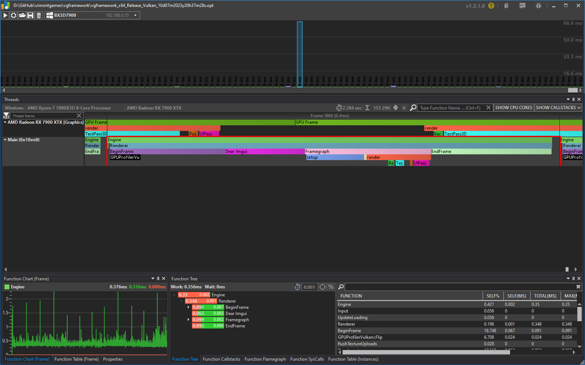

# vgframework
Yes, yet another work-in-progress game and graphic engine project :)

Its renderer only uses modern graphics APIs like DirectX12 and Vulkan (I would also like to support Metal the day I got and Apple device) so it can be 100% bindless from the very beginning and do strong choices in that direction:  
* instanciating and writing into GPU tables is not even exposed: You have to do all the rendering stuff the modern, bindless way. 
* All the interface is made to encourage using only push constants and one dynamic "instance" buffer, not updating tables constantly as if we were still emulating DX9.
* You can't access the command lists without using the framegraph that is part of the graphic driver layer. Go framegraph or do not render anything.
* Apart from the number of root constants, all shaders are sharing the same root signatures.

 
 
For the engine part, so far I integrated several "must-haves" tools like a CPU/GPU profiler, inputs, a job scheduler and Dear Imgui. I am currently implementing an Entity/Component system and reflection using ImGui.  

Another subject that is very close to my heart is that there is a strong separation between modules as the engine is "physically" split in several DLLs using only pure abstract interfaces.

# changelog

## 0.15
I could finally code for a few hours and the scene loading using reflection is now working. You can open the *.scene files from the "Scenes" tab. Loading is additive, meaning you can load several scenes at once.

# getting started

- Sync the depot.
- Install the required SDKs and configure the environment variables.
- Open the "vgframework.sln" solution in Visual Studio 2022 Community IDE.
- Build & Run

# keyboard shortcuts

- Press F1 to start/stop profiler capture
- Press F6 to hot reload shaders

# ide
VS Studio 2022 Community\
https://visualstudio.microsoft.com/fr/vs/community/

You can change the Solution Platform in Visual Studio's command line to toggle between the DirectX12 and the Vulkan renderers.\
Also don't forget to set the *working directory* to **$(SolutionDir)**.

# SDKs
FBX SDK 2020.0.1\
https://www.autodesk.com/developer-network/platform-technologies/fbx-sdk-2020-0  
**$(FBX_SDK)** should point to the FBX SDK installation dir *(i.e. "C:\SDK\FBX\2020.0.1")*

Vulkan SDK 1.2.148.0 (VK)\
https://vulkan.lunarg.com/sdk/home  
**$(VK_SDK_PATH)** should point the Vulkan SDK installation dir *(i.e. "C:\SDK\Vulkan\1.2.148.0")*

Win10 SDK 10.0.17763.0\
https://developer.microsoft.com/fr-fr/windows/downloads/sdk-archive/

# external libs
D3D12 Memory Allocator\
https://github.com/GPUOpen-LibrariesAndSDKs/D3D12MemoryAllocator

Dear ImGui\
https://github.com/ocornut/imgui

Dirent\
https://github.com/tronkko/dirent

Font-Awesome-6.x\
https://github.com/FortAwesome/Font-Awesome/tree/6.x

hlslpp\
https://github.com/redorav/hlslpp

IconFontCppHeaders\
https://github.com/juliettef/IconFontCppHeaders

ImGui-Addons\
https://github.com/gallickgunner/ImGui-Addons

magic_enum\
https://github.com/Neargye/magic_enum

optick 1.3.1\
https://github.com/bombomby/optick

You can download the binaries for optick 1.3.1 from https://github.com/bombomby/optick/releases/tag/1.3.1.0

px_sched\
https://github.com/pplux/px

stb\
https://github.com/nothings/stb

tinyXML2\
https://github.com/leethomason/tinyxml2

Vulkan Memory Allocator\
https://github.com/GPUOpen-LibrariesAndSDKs/VulkanMemoryAllocator

WinPixEventRuntime 1.0.200127001\
https://www.nuget.org/packages/WinPixEventRuntime

# models
Jess Casual Walking 001\
https://www.cgtrader.com/free-3d-models/character/woman/woman-jess-casual-walking-001

3d scan man 1\
https://www.cgtrader.com/free-3d-models/character/man/3d-scan-man

3D Scan Man Summer 016\
https://www.cgtrader.com/free-3d-models/character/man/3d-scan-man-summer-016

# disclaimer
Everything is heavily "Work-in-Progress" and 0% in an usable state, and I would not recommend anyone to use it yet.
